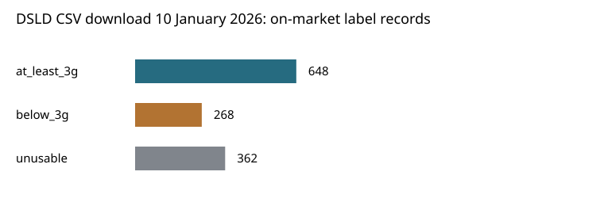

# Recorded creatine amounts

Dataset: DSLD CSV download 10 January 2026

Unit: distinct DSLD label ID. Selection: maximum usable recorded amount per serving.

| Group | Records |
|---|---:|
| at_least_3g | 648 |
| below_3g | 268 |
| unusable | 362 |

At least 3 g among usable records: 70.7%. Total on-market records: 1278.

Usable on-market records with additional unresolved declarations: 2.
Their observed maximum excludes those unresolved declarations; it is not a verified label-wide maximum.

These are automated label-amount classifications. Source-panel validation and manual candidate review remain separate steps. Daily intake, actual contents and effectiveness were not assessed.

See sensitivity.csv for alternative thresholds, serving selections, market populations, explicit-monohydrate aliases and case-insensitive matching. See run.json for provenance.
